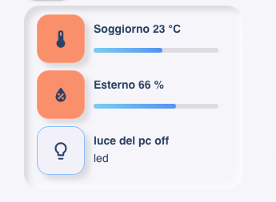
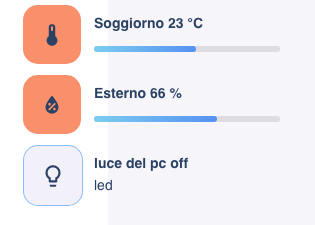

# NOTE: optimized for the soft_ui theme for the moment

# locelace config example

```yaml
- type: 'custom:soft-ui-general_panel_card'
  background: transparent
  innershadow: enable
  iconemboss: enable
  entities:
    - entity: sensor.salone_temperatura
      name: Soggiorno
      icon: 'mdi:thermometer'
      min: -10
      max: 50
      innershadow: enable
      cardtype: sensor
    - entity: sensor.salone_umidita
      name: Esterno
      icon: 'mdi:water-percent'
      min: 0
      max: 100
      cardtype: sensor
    - entity: light.luce_bagno_piccolo
      name: luce del pc
      icon: 'mdi:lightbulb-outline'
      cardtype: light
      label: led
        
        
```

soft_ui style



flat style


## Install

### Manual install

1. Download and copy `soft_ui_sensor_card_small.js` from (https://https://github.com/madmicio/soft_ui) into your `config/www` directory.

2. Add a reference to `soft_ui_sensor_card_small.js` inside your `ui-lovelace.yaml` or at the top of the *raw config editor UI*:

  ```yaml
  resources:
    - url: /local/soft_ui_sensor_card_small.js
      type: module
  ```

### Main Options
| Name | Type | Default | Supported options | Description |
| -------------- | ----------- | ------------ | ------------------------------------------------ | --------------------------------------------------------------------------------------------------------------------------------------------------------------------------------------------------------------------------------------------------------------------------------------------------------------------------------------------- |
| `type` | string | **Required** | `custom:soft_ui_sensor_card_small` | Type of the card |
| `entities` | string | **Required** | entity | list of entitity |
| `innershadow` | object list | optional | enable/disable | enable - disable innershadow in the card |
| `iconemboss` | object | optional | enable/disable | enable - disable icon emboss effect |

### entity Options
| Name | Type | Default | Supported options | Description |
| -------------- | ----------- | ------------ | ------------------------------------------------ | --------------------------------------------------------------------------------------------------------------------------------------------------------------------------------------------------------------------------------------------------------------------------------------------------------------------------------------------- |
| `entities` | string | optional | `sensor.ac` | entity_id |
| `name` | string | optional | `External temperature` | Define the name of the sensor |
| `icon` | string | optional | `mdi:icon` | Icon to display. Will be overriden by the icon defined in a state |
| `type` | string | optional | sensor / button | define the card style and function. in sensor mode return the sensor information, 
in button mode the icon becomes a button to activate / deactivate the entity |
